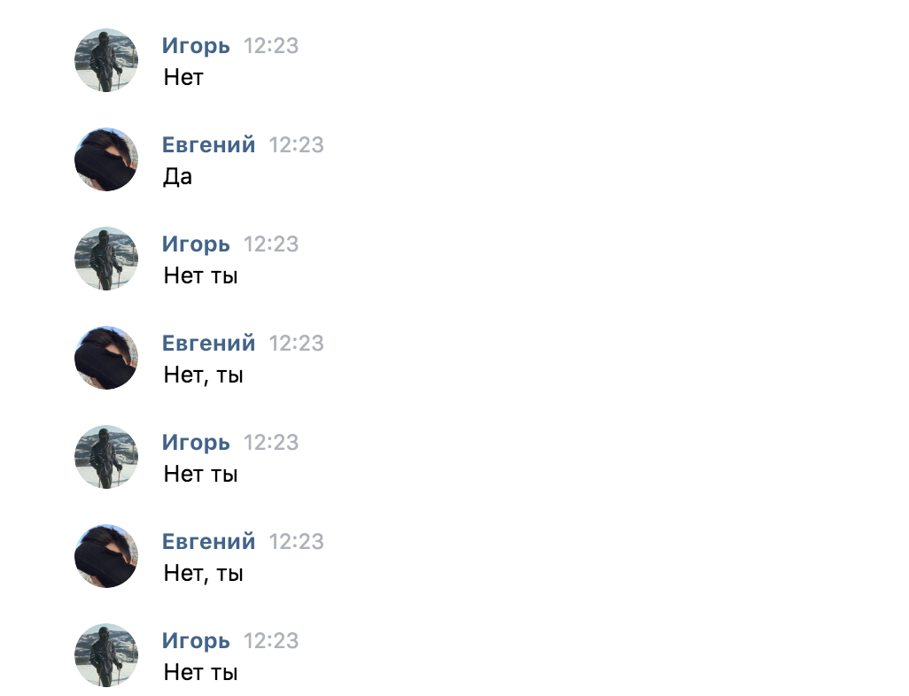

# Описание
Бот для ведения высокоинтелектуальных споров с людьми в ВК  
Умеет отвечать на простые сообщения

# Пример

# Работа с приложением
Команды для управления контейнером собраны в `docker.sh`.
 
Для запуска:
1. Потребуется [получить access token](https://vk.com/dev/access_token)  
2. Присвойте полученный токен перменной `ACCESS_TOKEN` в `docker.sh`
3. Соберите контейнер `./docker.sh b`
4. Запустите контейнер `./docker.sh r`
5. Готово

- Возвращаемые ответы можно протестировать `http://localhost:8080/test/${сообщение}` 
- При желании можно подключиться к контейнеру `./docker.sh с` 
и например, посмотреть логи `cat server.log`  
- Команда `./docker.sh s` остановит контейнер
- Если захотите почистить docker от созданных контейнеров и образов, 
запустите `./docker.sh cl --with-node` 
